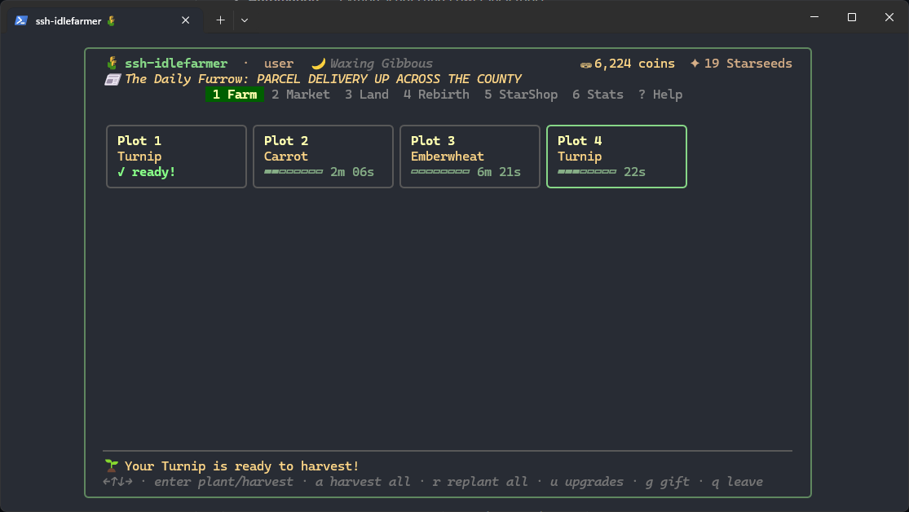

# Nigel Smith

**DevOps & Cloud Infrastructure Engineer** — I build and automate just about anything I can get my hands on.

Currently pursuing a B.S. in Cybersecurity at BYU-Idaho (Est. 2027) while working in the field.

---

## What I Work On

- **Cloud infrastructure** — AWS (IAM, EC2, RDS, S3, Lambda, VPC, Cognito), GCP, CloudFormation & IaC
- **Automation** — Python scripts and PowerShell tools
- **Systems & networking** — Linux servers, Windows Server, Proxmox, Cisco, Cloudflare
- **Managed IT** — M365 tenant admin, Exchange triage, endpoint management, on-prem network infrastructure

---

## Experience

**Fybercom (Technical Support)** — Configuring Ubiquiti, Cambium, and Tarana radio/fiber equipment; managing customer networks via CRM & troubleshooting through 200+ calls a month

**Roundsphere (DevOps Intern)** — Migrated production apps to IaC with AWS CloudFormation; cut cloud spend by 14% through RDS consolidation; oversaw Google Workspace migrations

**Full Coverage Tech (Cloud & IT Consultant)** — Sole technical contact for managed IT client; M365 admin, Exchange triage, endpoint management, and on-prem network deployments

---

## Certifications

| Credential | Status |
|---|---|
| ISC² Certified in Cybersecurity (CC) | Earned |
| CompTIA A+ | Earned |
| CompTIA Security+ | Anticipated July 2026 |
| AWS Cloud Practitioner | Anticipated July 2026 |

---

## Tech Stack

```
Cloud:       AWS · GCP · CloudFormation · IaC
Languages:   Python · PowerShell · Bash
Infra:       Linux · Windows Server · Proxmox
Networking:  Cisco · Cloudflare · Wireshark · Nmap
AI Tooling:  Claude Code · Cursor · n8n · Ollama
```

---

## Currently

- Based in Idaho Falls, ID — opten to relocation after graduation
- Building toward AWS Solutions Architect

---

[nigel.nds.smith@gmail.com](mailto:nigel.nds.smith@gmail.com) · [LinkedIn](https://linkedin.com/in/nigeld-smith) · [Portfolio](https://nigel-smith.dev)

---

# Projects

An overview of some of my **personal work** that I can share. These are what I am most proud of. 

---

## Highlights



> SSH Idlefarmer, an agentic engineered terminal user interface (TUI) that you can SSH into right now! Try `ssh farm.ssharcade.dev` (you need a keypair for it to work)


> My web portfolio, which will have more information on my projects. Can be reached at https://nigel-smith.dev/ and is deployed as a full-stack web app

 

